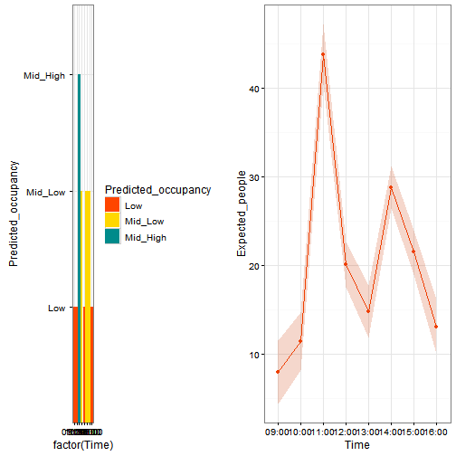

---
title: "Daily Classroom Occupancy"
author: "Who's There"
header-includes: 
   \usepackage{graphicx}
   \usepackage{fancyhdr}
   \pagestyle{fancy}
   \setlength\headheight{50pt}
   \fancyhead[L]{\includegraphics[width=2cm]{./logo.png} Who's There}
output:
  pdf_document:
    fig_height: 6
    fig_width: 16
---

**Day**:  
**Campus**:Belfield  
**Building**: Computer Science and Informatics Centre  
**Floor number**: 0  
**Room**:   
**Capacity of the room**: 90   
**Plug-friendly**: TRUE  

This document summarised the occupancy of the room estimated using the predicted values gathered through our models for the day requested.  

The data are summarised by the following table and graphs.  

------------------------------------------------------------------------
 Time   Predicted_occupancy   Expected_people   Max_people   Min_people 
------ --------------------- ----------------- ------------ ------------
09:00           Low                7.941          11.54        4.344    

10:00           Low                11.41          14.65        8.163    

11:00        Mid_High              43.85          47.24        40.46    

12:00         Mid_Low              20.09          22.66        17.52    

13:00           Low                14.77          17.71        11.83    

14:00         Mid_Low              28.82          31.22        26.42    

15:00         Mid_Low              21.5             24         18.99    

16:00           Low                13.02          16.11        9.924    
------------------------------------------------------------------------

